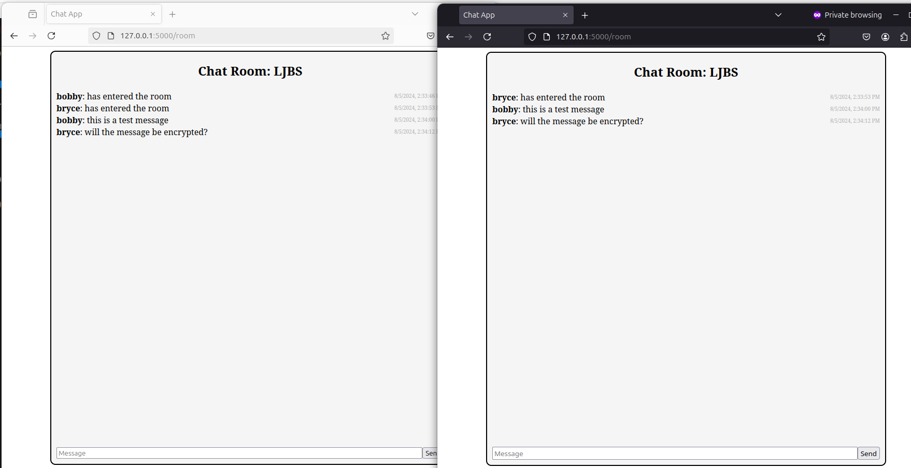
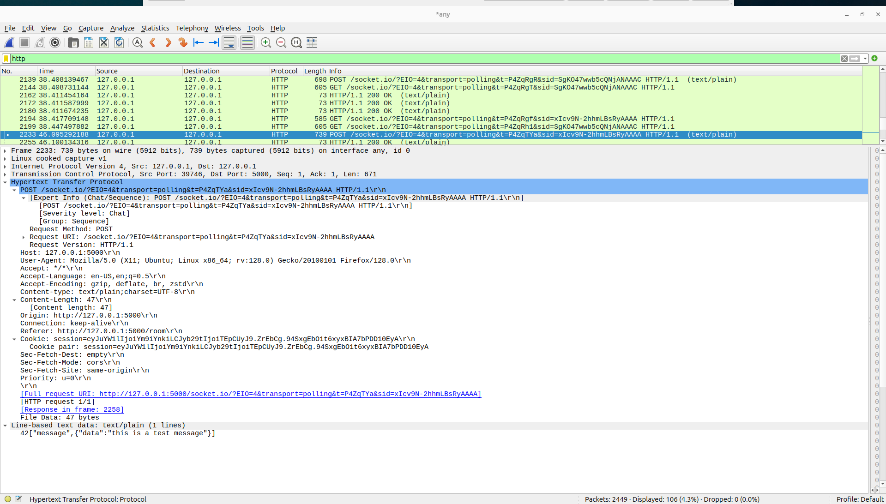

#### Secure Messaging Web Application

## Pre-Encryption - Using HTTP

The original set up of this web application uses HTTP protocol to transmit data between the parties within the chat box. Here I will show screenshots demonstrating how this is NOT a secure channel of communication. Even if the people communicating are in what they think is a secure "Chat Room" that has a 4 letter pass phrase to enter, it is still not safe due to the insecure nature of HTTP.


# Note the "this is a test message" within the chat!



# As you can see, the data transmitted is NOT encrypted.
**Look towards the bottom of this screen shot to see the data**



## Post-Encryption
In order to put a level of security on our web application. We will be applying HTTPS. 


```openssl req -x509 -newkey rsa:4096 -nodes -keyout key.pem -out cert.pem -days 365```

The openssl command provided generates a self-signed SSL certificate and a private key for encrypting data transmitted between a client and a server.

Here's a detailed explanation of each component:

- **Generates a New RSA Private Key and Certificate**: The `-newkey rsa:4096` option creates a new RSA private key with a length of 4096 bits. This key is essential for encrypting and decrypting data.
- **Creates a Self-Signed Certificate**: The `-x509` option indicates that the output should be a self-signed certificate rather than a certificate signing request. This certificate includes the public key and identifies the server.
- **Specifies File Locations**: The `-keyout key.pem` option saves the private key to `key.pem`, and `-out cert.pem` saves the self-signed certificate to `cert.pem`.
- **Disables Passphrase Protection**: The `-nodes` option ensures that the private key is not encrypted with a passphrase. This makes it easier to use the key in automated systems but should be handled carefully to avoid unauthorized access.
- **Sets Validity**: The `-days 365` option specifies that the certificate is valid for one year.

In practical terms, the `key.pem` file is your private key, which is used to decrypt data sent to the server. The `cert.pem` file is your self-signed certificate, which contains the public key and helps establish secure connections with clients. When a client connects to your server, it uses the public key from the certificate to encrypt data. The server then uses the private key to decrypt this data.

Using these files will ensure that the data transmitted between the client and server is encrypted. This encryption protects the data from being read if intercepted by someone capturing packets with tools like Wireshark. However, since the certificate is self-signed, browsers will show warnings about its trustworthiness, making it suitable for development but not for production. For production, a certificate from a recognized Certificate Authority is recommended.


## Reference
https://developers.yubico.com/PIV/Guides/Generating_keys_using_OpenSSL.html

